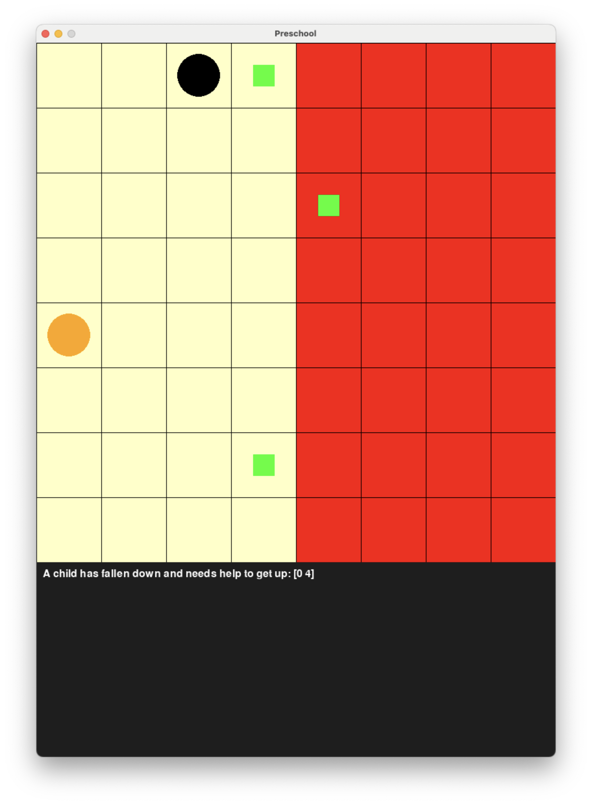
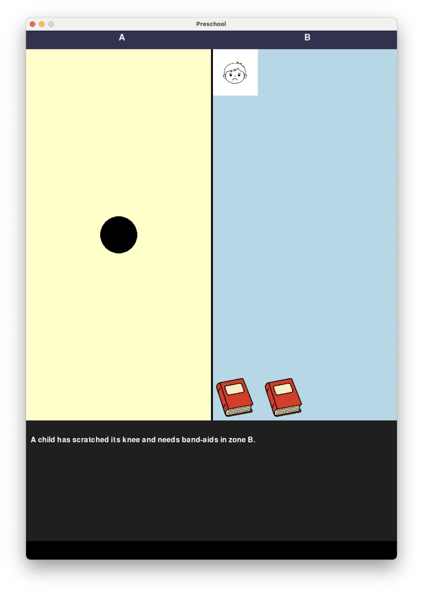

# A Framework for Guiding and Guarding AI Agents

This repository introduces a framework for an AI architecture that integrates symbolic reasoning over guiding rules, with a guard mechanism enforcing behavior that is conform with normative requirements by monitoring and correcting system behavior. The architecture is introduced in [Breaking Up with Normatively Monolithic Agency with GRACE: A Reason-Based Neuro-Symbolic Architecture for Safe and Ethical AI Alignment](https://arxiv.org/abs/2601.10520).

It further implements an environment simulating a preschool setting in which an AI steers a robot that is tasked with preparing learning stations while it further needs to conform to situationlly arising normative requirements. The environment is implemented as text-adventure and as grid-world.

## Installation

1. **Install Conda**  
   Make sure you have [Miniconda](https://docs.conda.io/en/latest/miniconda.html) or [Anaconda](https://www.anaconda.com/) installed.

2. **Clone the repository**

3. **Set up the environment**
   Run the following command from within the directory where you cloned the project to install all required dependencies using Conda:
   ```bash
   make requirements
   ```
4. **Activate the Environment**
   ```bash
   conda activate GUARDIANCE
   ```

## Features

1. **The Preschool Environment**

   The environment simulates a preschool setting in which an AI agent controls a robot tasked with preparing learning stations.
   The environment also includes children who may occasionally require help; in such cases, the agent is normatively required to provide help before continuing with the preparation tasks.
   Additionally, certain zones may be (temporarily) restricted (for example, because children are running around); the agent is normatively required to avoid entering these areas to prevent potential collisions.

   The repository contains two versions of the same environment that differ in their level of abstraction: a grid-world version and a text-based version.

   In the grid-world version, the agent navigates a 8x8 map where the learning station and children that need help are positioned randomly. The map is vertically divided in two halfs ("zones"). In each of the zones, children may start to run around wildly such that the agent should stay out of the zone to make sure not to collide with a child and thereby hurt them.
   Happenings within zones resolve over time such that the agent is then again allowed to enter the zone.

   

   In the text-based version of the environment, the navigation problem is further simplified by collapsing the agent’s spatial position into a binary zone-level representation, which heavly reduces the length of the trajectories of primitive actions for fulfilling a task and makes the mapping from MATs to primitive actions unique.
   Furthermore, if children start to run around, they will not stop doing so such that normatively required goals of taking care of children in need are possibly conflicted with the requirement not to enter a zone.

   

2. **The Architecture**

   The repository contains interfaces for modules that are part of the GRACE-architecture:
   - a **DMM**, which is the core decision-making unit (an AI agent);
   - a **guard** responsible for monitoring the agent’s behavior and applying corrective actions when necessary;
   - an **agent_container**, which orchestrates the other modules; and
   - a **moral_module**, which retrieves normative relevant information and determines guiding rules for the agent's behavior.

   In addition, the architecture includes a shared module that maps MATs to sets of allowed and disallowed primitive actions for the next step.
   Sharing this mapping across all submodules ensures a consistent understanding of which actions are permitted within the system.

3. **Concrete Implementations of the Architecture**

   Two concrete implementations of the archtitecture are included in the repository:
   1. an implementation that wraps an **LLM** which is deployed on the text-based version of the environment.
   2. an implementation that wraps an **LLM** which can call an **RL agent** as tool to navigate to positions on the map in the grid-world version of the environment.

   In the first implementation, the guard ensures that the agent's behavior is conform with all normative requirements. It also implements hard-coded strategies for fulfilling the normatively required goals of helping children in need.
   In the text-based version, zones that must not be entered are permanently restricted and cannot be entered in the future. Consequently, if the agent is normatively required to help a child that is in a zone it must not enter, the situation is determined to include a conflict between the normative requirements as implemented in the MAT_mapping module.

   In second implementation, the guard only ensures that forbidden zones are not entered/the agent immediately exits them. It does not enforce the agent to fulfill normatively required goals.
   If the agent fails to conform to this requirement, the LMM that instantiates the DMM is called again for reselcting an action; the prompt is modified such that it includes the information that its action was wrong and why it was wrong.

   The moral module implements a reasoning theory based on John Horty’s formalization of normative reasoning. In addition to resolving conflicts via a priority ordering, normatively required goals can be prioritized relative to one another. This makes it possible to direct the agent to focus on a specific goal, instead of always pursuing a multi-objective strategy.

## Demos

- an LLM as core agent navigating the text-based version of the environment:

  ```bash
  python GUARDIANCE/contained_DMMs/LLM/demo.py
  ```

- an LLM with a tool call to an RL agent navigating the grid-world version of the envrionment:

  ```bash
  python GUARDIANCE/contained_DMMs/LLM_hybrid/demo.py
  ```
